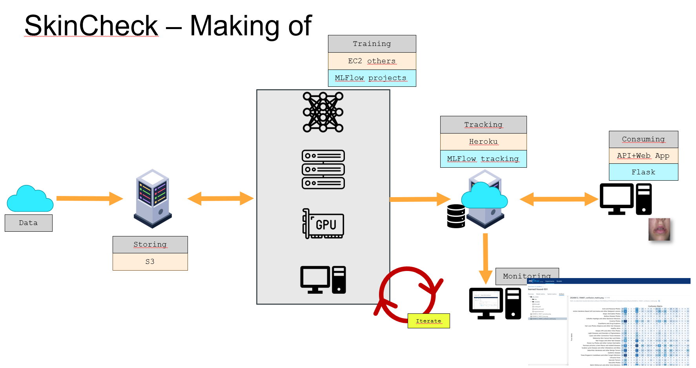

# Notes

* june 16 2024
* The instructions below have been reviewed at this date
* Some directories and filenames may have change since then but the overall proces remains the same
* The instructions suppose you are under WIN11. They should be similar if you are runnning *NIX like systems 

<p align="center">

</p>

# Open VSCode

1. Use file explorer to reach ``skincheck`` project directory
1. Right click and select ``Open a windows terminal``
1. Switch of virtual env : ``conda activate my_env``
    * If you don't have one create and brand new one now.
    * You will install lib in this env as needed
1. Launch VSCode : ``code .``

# What is next ?

Below, we will : 
1. Build the needed Docker image
1. Run a default training code (just to make sure something works)
1. Copy and customise our own training code

# Create an image where we will run the model training code

1. Make sure Docker is up and running
1. We build a docker image which will be used to run a ``train.py`` code which use tensorflow API 
1. From VSCode
1. Click on the directory named : `architecture\01_images_for_model_trainers\02_tensorflow_trainer`
1. Open a terminal there 
    * Right click on the name and select ``open in itegrated terminal``
1. Execute the command: `./build_skincheck_trainer_tf.ps1`
1. At the end, to check that the image is available, enter the command: `docker image ls`
    * The name your are looking for is `skincheck_trainer_tf`

## Optional but instructive
1. Read and understand the Dockerfile file
    * Find the name of the image `skincheck_trainer_tf`
    * Realise that the "flavor" of the image is mostly setup in ``requirements.txt``
1. Read ``requirements.txt`` and realise that the ``train.py`` file (the training code of your model) is **NOT** going to be able to do much.
    * Indeed in addition to the 4 mandatory lib, it only include pandas.
    * Later, if your train code need more lib, requirements.txt is where you will list them


# Test that the template code runs correctly

1. make sure mlflow is available in your current python virtual environment
    * ``conda list``
    * If not, you can either ``conda install mlflow`` or switch to a virtual environment where tensorflow is available
1. Go to the directory: `architecture\02_train_code\02_tensorflow\02_local`
There are 4 files:
* `MLproject`: will use the `skincheck_trainer_tf` image to run the training script (`train.py`)
    * We don't touch anything for now but later we can customize:
        * `name`: see "californian_housing_market" at the top of the file
        * parameters: see `epochs` and `batch_size` for example
* `run_experiment.ps1`
    * this is the script we will execute
    * It ensures that the environment variables are setup correclty and launches `mlflow` which will build the image and run the `train.py` in the image
* `secrets.ps1`
    * **DON'T TOUCH**
    * It is very important that `secrets.ps1` is in your the `.gitignore`. Double check it **NOW** !
* `train.py`
    * This is the code that:
        * Retrieves the data from the S3 bucket if needed
            * Be carreful not to overuse it. Until now, I'm the one who is paying.
            * By default it loads the data from a local directory (`./data`)
        * Trains the model
        * Times each step
        * Saves the artifacts on S3 as well as the parameters and the timing information on the `mlflow` tracking server
1. Open a console
1. Enter the command: `./run_experiment.ps1`
1. At the end, go to the `mlflow` tracking server and find the test results there
    * [https://skincheck-tracking-server-6e98556bcc6b.herokuapp.com/](https://skincheck-tracking-server-6e98556bcc6b.herokuapp.com/)
    * Realise that on the web page of the run, ``epoch`` and ``batch_size`` wich were passed as parameters (see MLproject file) to ``train.py`` are saved "for free" (no programming required)
    * On the ohter hand, ``load_time``, ``test_loss`` and others which appears as results on the web page require programming (one function call) 


# Modify the template to train your model, save its artifacts, and its parameters

1. Copy and paste the directory `architecture\02_train_code\02_tensorflow\02_local` in your own directory
    * **My recommendation** : for now, make a copy `architecture\02_train_code\02_tensorflow\` and name it as you want 
1. As long as you do not need to add lib (sklearn etc.) you do not need to rebuild the Docker image and we can focus on the training code
    * If you need one lib (say sklearn), go to the architecture\01_images_for_model_trainers
    * open the directory that correspond to the image to be used
    * edit the requirements.txt file (add a line with scikit-learn or seaborn)
    * open a terminal in that directory
    * call the build_XXX.ps1
1. Open `secrets.ps1`
    * Moditfy the name of the experiment 
    * **My recommendation** : I like to use a name + a date [20240615 for example]
1. Open `MLproject`
    * Adapt the top line to your needs :
        * `name: californian_housing_market`
        * Don't worry it is just a name
    * `entry_points`
        * Here the `main` block specifies which script to launch. We leave as it is.
    * The `parameters` block:
        * If needed, update the parameter names and their values
1. Open `run_experiment.ps1`
    * You should have nothing to do except if you want to overwrite the default parameters


# How to modify the template code?
1. It is a very academic/didactic object-oriented code
    * Each method comes with some documentation
    * Each method provide hints for expected input and the output

1. At the top, adapt the constant:
    * `k_RelativePath = "modeling_housing_market"`
    * This is the name under which all your runs will be grouped

1. In the `ModelTrainer` class

    In most methods, the code to modify is between the 2 lines below :

    ```python
    start_time = time.time()
    ...
    ...
    ...
    mlflow.log_metric("load_data_time", time.time() - start_time)
    ```
    
    It is best not to touch these 2 lines and make sure that the returned values are the same as those in the template (use the hints if needed). If you need to change the type or the number of return value feel free to do so. Just make sure the rest of your code is modified accordingly. 

    **My recommendation** : brose the child directories of ./02_train_code. You will find examples of ``train.py`` where methods from the template have been modified more. One example is in `../architecture/02_train_code/03_inceptionV3/train.py` 

    In the ``ModelTrainer`` class you will find : 

    1. `__init__()` method
        * save additional parameters here if any
        * see in `main` how to instantiate a `ModelTrainer` class object before invoking `.run()`
    
    1. `load_data()` method
        * Load your data into `data`

    1. `preprocess_data()` method
        * This is where you process the data

    1. `build_model()` method
        * Specify your model's architecture

    1. `train_model()` method
        * Normally, you shouldn't have to do anything
    
    1. `evaluate_model()` method
        * Normally, you shouldn't have to do anything

    1. `log_parameters()` method
        * Normally, you shouldn't have to do anything
        * If you have additional parameters, add them

    1. `log_model()` method
        * Normally, you shouldn't have to do anything

    1. `run()` method
        * It calls the other methods passing the parameters
        * Normally, you shouldn't have to do anything

1. `__main__` function
    * Normally, you shouldn't have to do anything
        * If you kept `epochs` and `batch_size` as parameters
    * Otherwise, be inspired by the existing code to include your own parameters


# Final notes
* Keep your ``secrets.ps1`` secret!
* Feel free to explore and to read the other `train.py` source files in the ``architecture\02_train_code`` folders.
* Before to `run_experiement.ps1` make sur the required image is built and available (you will get a message otherwise)
* I tried to keep the ``train.py`` consistent even if they tend be "improved/complexified" with time
* Keep in mind that in the ``architecture\02_train_code``, the index at the begining of the directory name indicates (more or less) the date (the lower, the older)
* For example if you want to :
    * Save plot (loss, accuracy...) as png amongs artifact, you can read `architecture\02_train_code\03_inceptionV3\01_raw_model\train.py`
    * If you want to add some tags to your runs, read `architecture\02_train_code\03_inceptionV3\04_unfreeze_layers\train.py`
